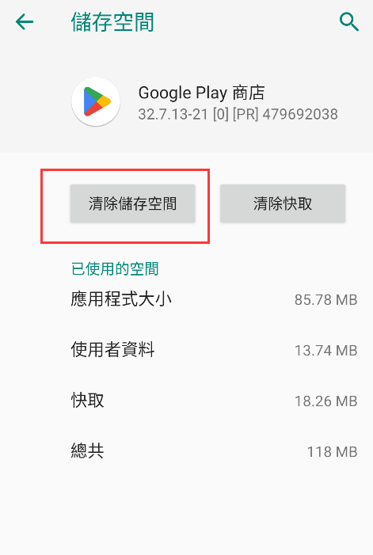
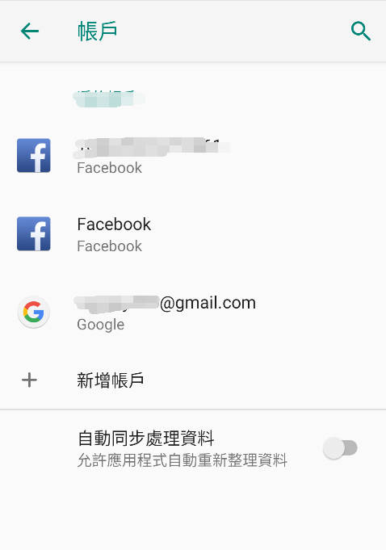

# 常见问题
## 1.弹出这个支付错误信息 ：The BillingClient is not ready,code=3: In-app billing API version 3 is not supported on this device.. ##

1.确保手机上有原生Google三套件，建议用海外的自带Google3件套的手机测试
2.保证手机上登录Google账号不能是中国地区的，不能在中国地区内登录过，而且测试手机上必须只登录一个测试的Google账号，没有其他的Google账号
3.设置-应用-找到Google商店,清除数据
 

同样的，找到对应游戏的应用，把游戏的数据也都清除掉

4.开启vpn，在手机账号管理界面只登录测试的Google账号，其他Google账号都退出
