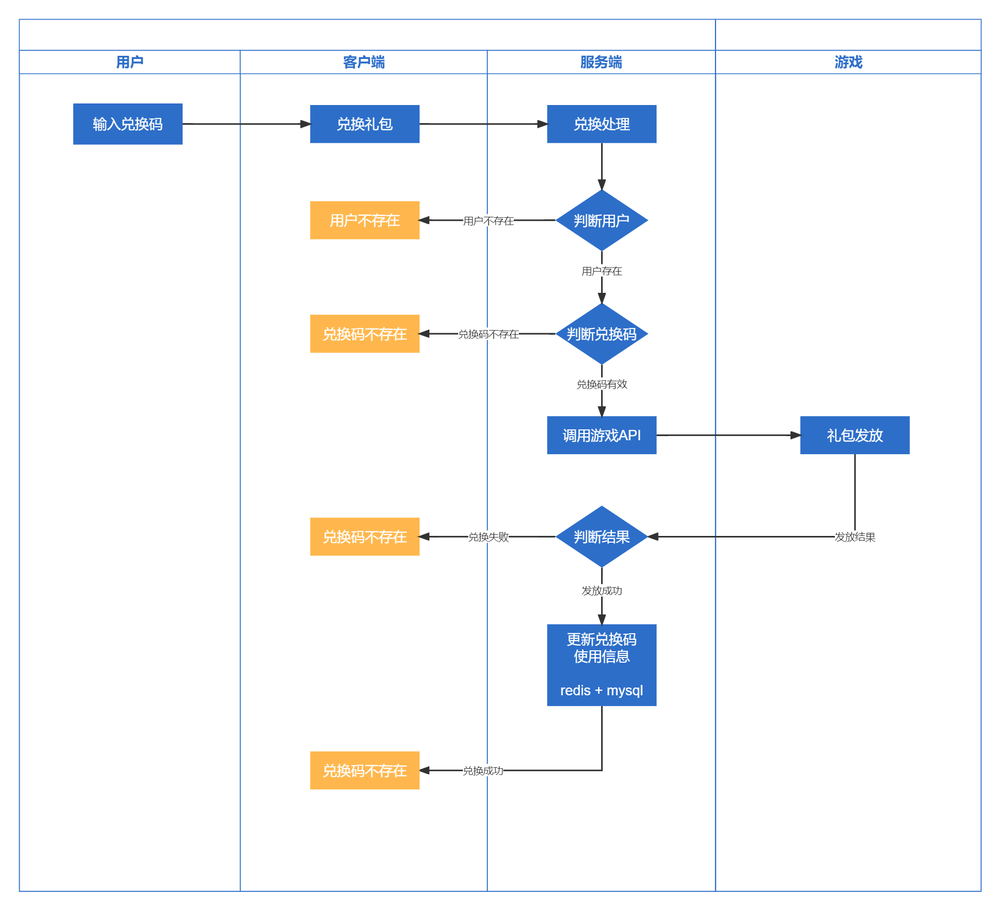

# 礼包功能介绍

## 礼包兑换流程
 

## 礼包表结构

### 游戏表
Table：azura_game

| name       | type        | 说明   | 备注     |
|------------|-------------|------|--------|
| id         | int(10)     | ID   |  |
| game_name  | string(32)  | 游戏名称 |  |
| game_no    | string(16)  | 游戏编号 |  |
| created_at | int(10)     | 创建时间 |  |
| updated_at | int(10)     | 更新时间 |  |
| deleted_at | int(10)     | 删除时间 |  |

### 礼包表
Table：azura_game_gift

| name             | type        | 说明 | 备注                |
|------------------|-------------|----|-------------------|
| id               | int(10)     | ID |                   |
| game_id          | int(10)     | 游戏ID |                   |
| gift_name        | string(32)  | 礼包名称 |                   |
| exchange_ceiling | tinyint(3)  | 单账号兑换上限  | 默认1 同一个礼包多张券可兑换限制 |
| receive_grade    | tinyint(3)  | 领取等级  | 0不限制              |
| gift_conf        | string(128) | 礼包配置  |                   |
| exchange_url     | string(196) | 礼包兑换接口  | 游戏提供兑换API         |
| created_at       | int(10)     | 创建时间 |                   |
| updated_at       | int(10)     | 更新时间 |                   |
| deleted_at       | int(10)     | 删除时间 |                   |

### 礼包批次表
Table：azura_game_gift_batch

| name       | type        | 说明              | 备注            |
|------------|-------------|-----------------|---------------|
| id         | int(10)     | ID              |               |
| game_id          | int(10)     | 游戏ID |                   |
| gift_name        | string(32)  | 礼包名称 |                   |
| exchange_ceiling | tinyint(3)  | 单账号兑换上限  | 默认1 同一个礼包多张券可兑换限制 |
| receive_grade    | tinyint(3)  | 领取等级  | 0不限制              |
| gift_conf        | string(128) | 礼包配置  |                   |
| exchange_url     | string(196) | 礼包兑换接口  | 游戏提供兑换API         |
| gift_id    | int(10)     | 礼包ID            |               |
| is_public  | tinyint(3)  | 通用礼包码  | 1通过 0不通用      |
| num        | smallint(5) | 礼包码数量           |               |
| start_time | int(10)     | 礼包开始时间          |               |
| end_time   | int(10)     | 礼包过期时间          |               |
| status     | tinyint(3)  | 状态 |状态 0待生成、1成功、2生成中 |
| created_at | int(10)     | 创建时间            |               |
| updated_at | int(10)     | 更新时间            |               |
| deleted_at | int(10)     | 删除时间            |               |

### 礼包码表
Table：azura_game_gift_code

| name      | type       | 说明   | 备注                |
|-----------|------------|------|-------------------|
| id        | int(10)    | ID   |                   |
| game_id   | int(10)    | 游戏ID |                   |
| gift_id   | int(10)    | 礼包ID |                   |
| batch_id  | int(10)    | 批次ID |                   |
| code      | string(16) | 兑换码  |                   |
| ex_role_id | string(32) | 兑换角色ID |                   |
| ex_role_server | string(32) | 兑换区服   |                   |
| ex_role_nick | string(64) | 兑换角色昵称 |                   |
| ex_role_grade | int(10)    | 兑换角色等级 |                   |
| ex_time   | int(10)    | 兑换时间 |                   |
| status    | tinyint(3) | 状态   | 0待兑换、1兑换成功、2兑换失败  |
| created_at | int(10)    | 创建时间 |                   |
| updated_at | int(10)    | 更新时间 |                   |
| deleted_at | int(10)    | 删除时间 |                   |
