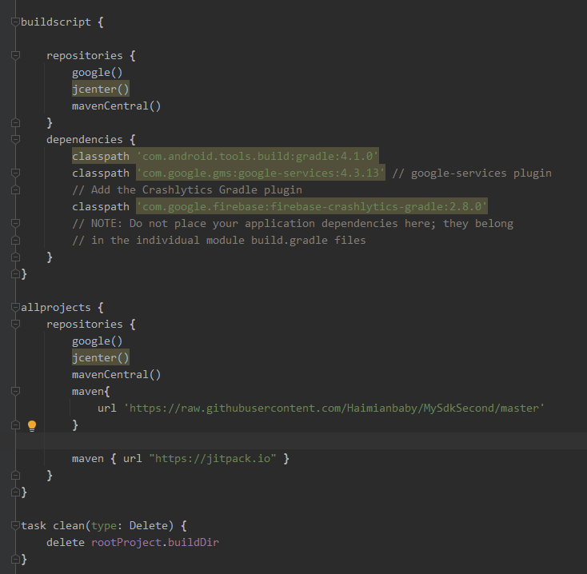
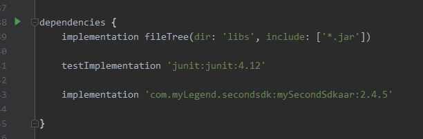
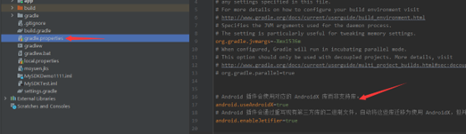
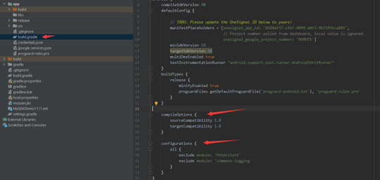
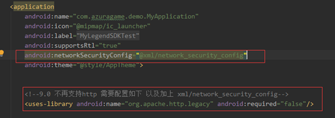

> [!NOTE|style:flat|labelVisibility:hidden|iconVisibility:hidden]
> 
> **本文介绍如何快速接入 Android SDK 并实现 登录 功能。**
>

<div style="display:none">
页面提供了 Android 示例项目，可供参考。
</div>


# (一)创建应用
---
请登录 **开发者中心** 注册为开发者并创建应用。

# (二)环境要求
---
- Unity 2019.4 或更高版本
- Android 5.0（API level 21）或更高版本

# (三)项目配置
---

> [!DANGER|label:特别注意]
>
> **aab包体需要控制在150M之内**
> 
> 参考官方文档https://developer.android.com/guide/app-bundle/asset-delivery?authuser=1
>

## 1. 获取必要参数 ###

参数 |	说明
  --|:--:
gameId	|游戏ID
appkey	|游戏加密密钥
channelId	|渠道 ID，目前固定为“GP”

## 2. 引入Android studio 依赖 ###
### 1）在工程的根目录gradle中加入maven仓库的引用地址 #####

 

```gradle
buildscript {
	repositories {
    	google()
    	jcenter()
    	mavenCentral()
}
dependencies {
    classpath 'com.android.tools.build:gradle:4.2.0' // 最低4.1.0，不然可能会编译错误
    classpath 'com.google.gms:google-services:4.3.13' // google-services plugin 最低4.2.0，不然可能会编译错误
    // Add the Crashlytics Gradle plugin
    classpath 'com.google.firebase:firebase-crashlytics-gradle:2.8.0'
    // NOTE: Do not place your application dependencies here; they belong
    // in the individual module build.gradle files
	}
}

allprojects {
repositories {
    google()
    jcenter()
    mavenCentral()
    maven{
        url 'https://raw.githubusercontent.com/Haimianbaby/MySdkSecond/master'
    }

    maven { url "https://jitpack.io" }
	}
}

```

### 2）在工程的app gradle  dependencies中加入aar引用并加上google配置 #####

在最顶部加入   
 

```gradle
apply plugin: 'com.google.gms.google-services'
// Apply the Crashlytics Gradle plugin 这个一定要加在com.google.gms.google-services之后
apply plugin: 'com.google.firebase.crashlytics'

```

在依赖中加入   


```gradle
implementation 'com.myLegend.secondsdk:mySecondSdkaar:2.4.8'

```

### 3）必须拷贝assets里的配置文件 #####

sdk_config文件中配置正式域名和测试域名，
adjust_config.xml 文件中配置adjust事件token

 

### 4）开启Androidx插件 #####

在gradle.properties中添加下面的代码 

 
    // Android 插件会使用对应的 AndroidX 库而非支持库。
	android.useAndroidX=true
	// Android 插件会通过重写现有第三方库的二进制文件，自动将这些库迁移为使用 AndroidX，但并不完全自动。
	android.enableJetifier=true

然后在项目build.gradle里添加



```gradle
android {
    ...
    ...
    compileOptions {
        sourceCompatibility 1.8
        targetCompatibility 1.8
}

configurations {
    all {
        exclude module: 'httpclient'
        exclude module: 'commons-logging'
    }
}
....
....
}

```

## 3. 配置AndroidManifest.xml ###

### 1）在工程 AndroidManifest.xml 加入以下权限 #####

```xml

<uses-permission android:name="android.permission.INTERNET" />
<uses-permission android:name="android.permission.MOUNT_UNMOUNT_FILESYSTEMS"
    tools:ignore="ProtectedPermissions"/>
<uses-permission android:name="android.permission.ACCESS_NETWORK_STATE" />
<uses-permission android:name="android.permission.ACCESS_WIFI_STATE" />
<uses-permission android:name="android.permission.CHANGE_WIFI_STATE" />
<uses-permission android:name="com.android.vending.BILLING" />

```

### 2）AndroidManifest.xml 配置 #####

```xml
//<!--name配置自己的Application路径-->
<application
    android:name=".MyApplication"
    android:icon="@mipmap/ic_launcher"
    android:label="@string/app_name"
    android:supportsRtl="true"
    android:networkSecurityConfig="@xml/network_security_config"
    android:theme="@style/AppTheme">

```



<font color=red size=2>为了适配targetSdkVersion 28,需要加入以下配置，不加入可能会无法使用http链接
在application标签下加上</font>

	android:networkSecurityConfig="@xml/network_security_config"

<font color=red size=2>9.0 不再支持http 需要配置如下 以及加上 xml/network_security_config</font>

	<uses-library android:name="org.apache.http.legacy" android:required="false"/>

在<manifest> 节点下加入，注意不要加在<application>节点下，用于查找是否安装Facebook app

```xml
<manifest
	...
<queries>
    <package android:name="com.facebook.katana" />
</queries>
	....
<application
	.....
<application/>

```

其他配置

```xml
<!-- screenOrientation 设置应用的方向 ,
加上screenSize|orientation|keyboardHidden|navigation防止屏幕旋转的时候重建	
控制软键盘的弹出与隐藏:android:windowSoftInputMode="stateHidden|adjustPan"-->

<activity
    android:name=".MainActivity"
    android:screenOrientation="portrait"
    android:launchMode="singleTask"
    android:configChanges="screenSize|orientation|keyboardHidden|navigation"
    android:windowSoftInputMode="stateHidden|adjustPan"
    android:exported="true">
    <intent-filter>
        <action android:name="android.intent.action.MAIN" />
        <category android:name="android.intent.category.LAUNCHER" />
    </intent-filter>
</activity>

<!--sdk 配置start-->
<activity
    android:name="com.myBest.sdk.ShowWebActivity"
    android:configChanges="screenSize|orientation|keyboardHidden|navigation"
    android:screenOrientation="portrait"
    android:exported="false"
    >
</activity>

<service
    android:name="com.myBest.sdk.service.MyFirebaseMessagingService"
    android:exported="false">
    <intent-filter>
        <action android:name="com.google.firebase.MESSAGING_EVENT" />
    </intent-filter>
</service>

<!--facebook配置-->
<meta-data
    android:name="com.facebook.sdk.ApplicationId"
    android:value="@string/facebook_app_id" />

<meta-data android:name="com.facebook.sdk.ClientToken"
    android:value="@string/facebook_client_token"/>
<activity
    android:name="com.facebook.FacebookActivity"
    android:configChanges="keyboard|keyboardHidden|screenLayout|screenSize|orientation"
    android:label="@string/app_name"/>
<activity
    android:name="com.facebook.CustomTabActivity"
    android:exported="true">
    <intent-filter>
        <action android:name="android.intent.action.VIEW" />

        <category android:name="android.intent.category.DEFAULT" />
        <category android:name="android.intent.category.BROWSABLE" />

        <data android:scheme="@string/fb_login_protocol_scheme" />
    </intent-filter>
</activity>

<provider
    android:name="com.facebook.FacebookContentProvider"
    android:authorities="com.facebook.app.FacebookContentProvider自己的Facebook id"
    android:exported="true" />
<!--facebook配置-->

<!--Adjust配置-->
<meta-data
    android:name="com.google.android.gms.version"
    android:value="@integer/google_play_services_version" />
<receiver
    android:name="com.adjust.sdk.AdjustReferrerReceiver"
    android:exported="true"
    android:permission="android.permission.INSTALL_PACKAGES">
    <intent-filter>
        <action android:name="com.android.vending.INSTALL_REFERRER" />
    </intent-filter>
</receiver>

<!--Adjust申请的APPtoken-->
<meta-data
    android:name="Adjust_AppToken"
    android:value="换成自己的adjust id"></meta-data>

<meta-data
    android:name="Adjust_secret1"
    android:value="1" />
<meta-data
    android:name="Adjust_secret2"
    android:value="xxxx" />
<meta-data
    android:name="Adjust_secret3"
    android:value="xxx" />
<meta-data
    android:name="Adjust_secret4"
    android:value="xxx" />
<meta-data
    android:name="Adjust_secret5"
    android:value="xxxx" />

<!--google 登录配置-->
<meta-data
    android:name="Google_SingIn_Key"
    android:value="@string/google_singin_key"></meta-data>
<!--sdk 配置end-->

```

Facebook所需要配置的参数
<font color=red size=2> strings.xml里 特别注意修改：</font>

```xml
<string name="facebook_app_id" translatable="false">自己的Facebook id</string>
<string name="fb_login_protocol_scheme" translatable="false">fb自己的Facebook id</string>
<string name="facebook_client_token">Facebook token参数</string>
<string  name="google_singin_key" translatable="false">Google 登录id</string>

```

至此所需的sdk前置配置都已完成，可以进行下一步sdk的接入了


 


