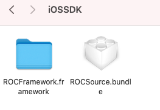
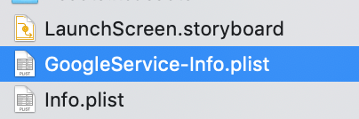
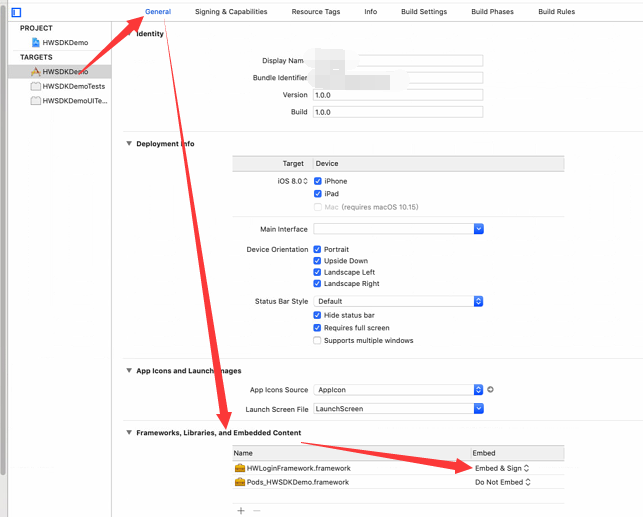
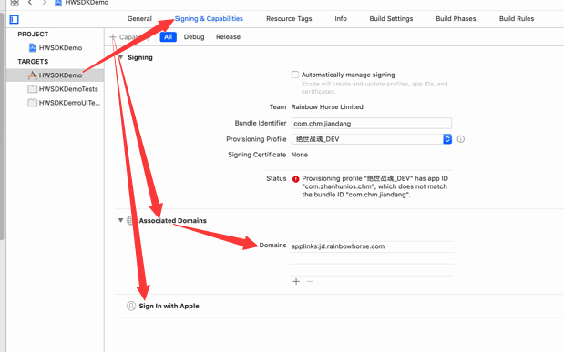

## 接入前事项 ##
- iOS版本要求  iOS11.0+
- 使用cocoapods集成管理三方库，以防止两边有共用三方库引起冲突

## 1. 将SDK集成到Xcode工程中
### 1.0 把iOSSDK文件夹下的 framework + source.bundle 添加到工程中


### 1.1 工程添加google配置文件和Plist文件同级目录下


### 如下所示:


##  2. 工程配置
### 2.0 target => general 


### 2.1 target => Signing & Capabilities
#### applinks:其值请查看参数表


### 2.2 推送配置


### 2.3 添加framework
- AdSupport.framework
- iAd.framework
- AdServices.framework
- CoreTelephony.framework
- StoreKit.framework
- AppTrackingTransparency.framework
- SafariServices.framework
#### 其中 AppTrackingTransparency.framework、AdServices.framework    注意修改Status: Optional 如下:


### 2.4 target => Build Settings   添加:-ObjC(O和C大写) 


### 2.5 target => Build Settings    bitcode 设置为:NO


## 3. info.plist文件配置
###  3.1 添加如下code
```OC
<key>CFBundleURLTypes</key>
	<array>
		<dict>
			<key>CFBundleTypeRole</key>
			<string>Editor</string>
			<key>CFBundleURLSchemes</key>
			<array>
				<string>⚠️#可查看参数表#⚠️</string>
			</array>
		</dict>
	</array>
    <key>FacebookAppID</key>
    <string>⚠️#可查看参数表#⚠️</string>
	<key>FacebookClientToken</key>
	<string>⚠️#可查看参数表#⚠️</string>
    <key>FacebookDisplayName</key>
    <string>⚠️#可查看参数表#⚠️</string>
    <key>LSApplicationQueriesSchemes</key>
    <array>
        <string>fbapi</string>
        <string>fbapi20130214</string>
        <string>fbapi20130410</string>
        <string>fbapi20130702</string>
        <string>fbapi20131010</string>
        <string>fbapi20131219</string>
        <string>fbapi20140410</string>
        <string>fbapi20140116</string>
        <string>fbapi20150313</string>
        <string>fbapi20150629</string>
        <string>fbapi20160328</string>
        <string>fbauth</string>
        <string>fb-messenger-share-api</string>
        <string>fbauth2</string>
        <string>fbshareextension</string>
    </array>
```
### 3.2 添加如下标签


### 3.3 value改为应用名


### 3.4 添加隐私标签  ⚠️语言国际化可参考隐私本地化表


### 3.5 添加广告追踪标签 ⚠️语言国际化可参考隐私本地化表


## 4. 使用cocoaPods集成其它三方库到工程中
```podfile
source 'https://github.com/CocoaPods/Specs.git'

platform:ios, ’11.0’
inhibit_all_warnings!

use_frameworks!
target '⚠️#工程主target#⚠️' do

   pod 'FBSDKCoreKit', '~> 14.1.0'
   pod 'FBSDKLoginKit', '~> 14.1.0'
   pod 'FBSDKShareKit', '~> 14.1.0'
   pod 'Firebase/Analytics'
   pod 'Firebase/Crashlytics'
   pod 'FirebaseMessaging'
   pod 'YYModel', '~> 1.0.4'
   pod 'Adjust', '~> 4.32.0'
   
end
```


